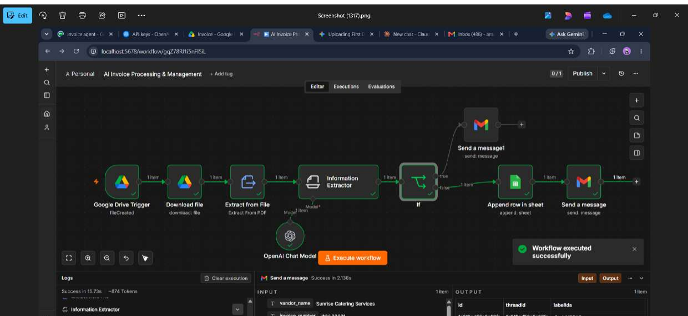
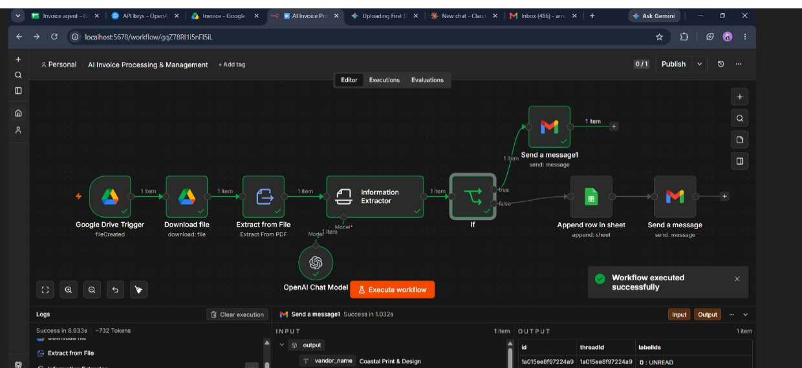

# AI Invoice Processing & Management (n8n)

AI-powered n8n workflow that automates invoice processing — extracts data from PDFs using GPT-4o-mini, validates it, logs it to Google Sheets, and sends email notifications, with automatic manual-review alerts for incomplete invoices.

Manual invoice entry is repetitive and error-prone. This workflow removes the manual step: invoices are read, structured, logged, and reported automatically — with a safety net that flags anything the AI couldn't confidently extract, instead of silently logging bad data.

## 🎥 Demo Video

*(Click the image above to watch the full walkthrough on YouTube)*

## 🖼️ Screenshots

### Workflow Execution

### AI-Extracted Invoice Data

## ⚙️ How It Works

1. **Google Drive Trigger** — Polls a specific Drive folder every minute for newly uploaded invoice files.
2. **Download File** — Pulls the new file from Drive.
3. **Extract from File** — Extracts raw text from the invoice PDF.
4. **Information Extractor (AI, GPT-4o-mini)** — Reads the extracted text and pulls out structured fields:
   - Vendor name
   - Invoice number
   - Invoice date
   - Due date
   - Bill-to name
   - Subtotal
   - Tax amount
   - Total amount
5. **IF Node (Validation)** — Checks whether the invoice number and total amount were actually found.
   - ❌ **Missing data** → sends a "Manual Review Needed" email flagging the file for a human to check.
   - ✅ **Data complete** → proceeds to log and notify.
6. **Append Row in Google Sheets** — Saves the structured invoice data to a tracking spreadsheet.
7. **Send Email** — Notifies the billing team with a formatted summary of the processed invoice.

## 🧩 Tech Stack

- **n8n** — workflow orchestration
- **Google Drive** — invoice intake (trigger + file download)
- **OpenAI (GPT-4o-mini)** — AI-powered data extraction via LangChain Information Extractor node
- **Google Sheets** — structured data storage / invoice log
- **Gmail** — automated notifications (success + failure alerts)

## 🚀 Setup

1. Import `AI_Invoice_Processing_Management.json` into your n8n instance.
2. Connect your own credentials for:
   - Google Drive OAuth2
   - Google Sheets OAuth2
   - Gmail OAuth2
   - OpenAI API
3. Update these placeholders with your own values:
   - `YOUR_FOLDER_ID` — the Google Drive folder to watch for invoices
   - `YOUR_SHEET_ID` — the Google Sheet where extracted data will be logged
   - `your-email@example.com` — the notification recipient
4. Activate the workflow.

## 🔒 Note

Credential IDs, folder IDs, sheet IDs, and personal email addresses have been removed from the shared workflow JSON. Replace the placeholders with your own before importing.
